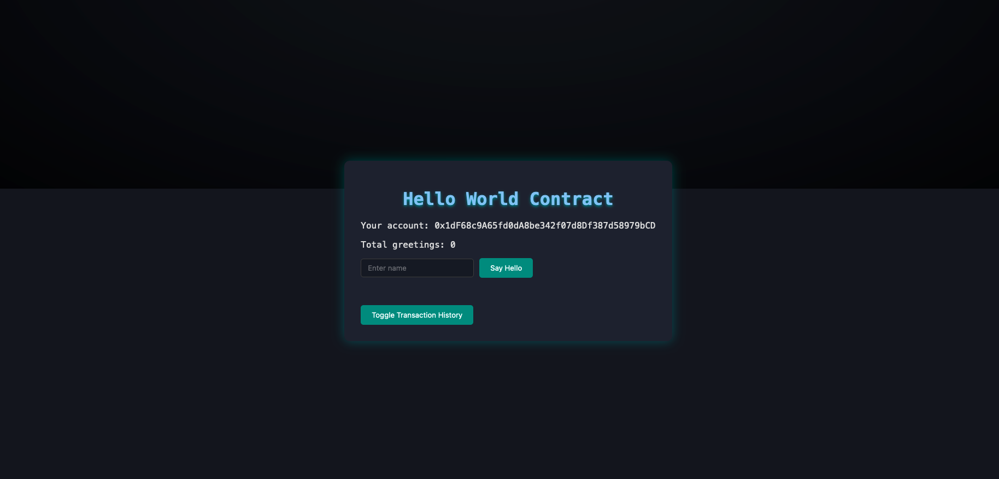
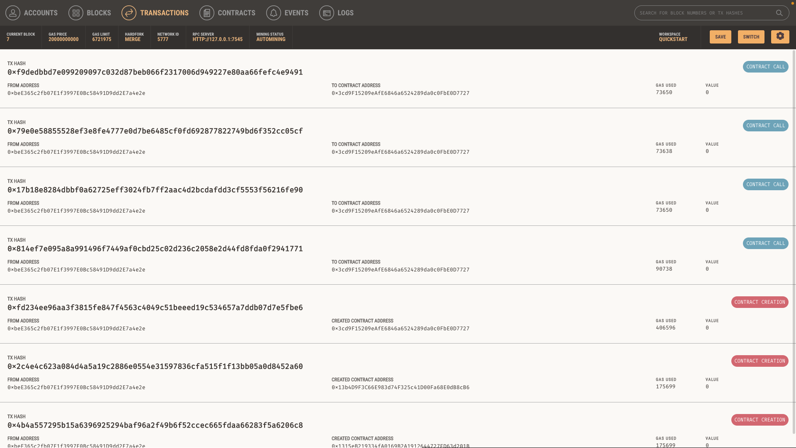

# Frontend with Ethereum - Network Backend + Smart Contract






## Set up


1. First I installed all the dependencies:

ganache-cli
```bash
npm install -g ganache-cli
```

brownie using the following command:
```bash
pip install eth-brownie
```

2. Then I created a new brownie project using the following command:
```bash
brownie init <name-of-the-project>
```

3. I created a new smart contract called "HelloWorld.sol" in the contracts folder and added the following code:
```solidity
// SPDX-License-Identifier: MIT
pragma solidity ^0.8.0;


contract HelloWorld {
    function sayHello() public pure returns (string memory) {
        return "Hello World";
    }
    
    function sayHelloTo(string memory name) public pure returns (string memory) {
        return string(abi.encodePacked("Hello, ", name));
    }
}
```

Lets explain some basic solidity concepts:
- `pragma solidity ^0.8.0;`: This line specifies the version of Solidity that the contract is written in. The caret (^) symbol means that the contract can be compiled using any version of Solidity that is compatible with version 0.8.0.
- `contract HelloWorld {`: This line creates a new contract called HelloWorld. A contract is a collection of functions and data (also known as state variables) that resides at a specific address on the Ethereum blockchain. The contract is the fundamental building block of Ethereum applications.


After that i run: 
```bash
    brownie  compile                                                                                                                                                                             
Brownie v1.20.1 - Python development framework for Ethereum

Downloading from https://solc-bin.ethereum.org/macosx-amd64/solc-macosx-amd64-v0.8.24+commit.e11b9ed9
100%|██████████████████████████████████████████████████████████████████████████████████████████████████████████████████████████████████████████████████████████████| 79.0M/79.0M [03:39<00:00, 359kiB/s]
Using solc version 0.8.24
solc 0.8.24 successfully installed at: /Users/vtwoptwo/.solcx/solc-v0.8.24
Compiling contracts...
  Solc version: 0.8.24
  Optimizer: Enabled  Runs: 200
  EVM Version: Istanbul
Generating build data...
 - HelloWorld

Project has been compiled. Build artifacts saved at /Users/vtwoptwo/vtwoptwo/projects/blockchain/ethereum-metamask-contract-fe/web-app/build/contracts
```

```bash

brownie networks add Ethereum ganache-local  host=http://127.0.0.1:7545 chainid=5777      
```

```bash
brownie networks add Ethereum ganache-local  host=http://127.0.0.1:7545 chainid=5777                                                                                                           1 ↵
Brownie v1.20.1 - Python development framework for Ethereum

SUCCESS: A new network 'ganache-local' has been added
  └─ganache-local
    ├─id: ganache-local
    ├─chainid: 5777
    └─host: http://127.0.0.1:7545

```

```bash
brownie run deploy_hello_world --network ganache-local
Brownie v1.20.1 - Python development framework for Ethereum

WebAppProject is the active project.

Running 'scripts/deploy_hello_world.py::main'...
Transaction sent: 0x4b4a557295b15a6396925294baf96a2f49b6f52ccec665fdaa66283f5a6206c8
  Max fee: 3.0 gwei   Priority fee: 1.0 gwei   Gas limit: 193268   Nonce: 0
  HelloWorld.constructor confirmed   Block: 1   Gas used: 175699 (90.91%)   Gas price: 1.875 gwei
  HelloWorld deployed at: 0x1315eB219334fA0169B2A1912644727ED63d201B

Contract deployed to 0x1315eB219334fA0169B2A1912644727ED63d201B
```


After we update the script to a personalized greeting:
```python
╰─➤  brownie run deploy_hello_world --network ganache-local
Brownie v1.20.1 - Python development framework for Ethereum

WebAppProject is the active project.

Running 'scripts/deploy_hello_world.py::main'...
Transaction sent: 0x2c4e4c623a084d4a5a19c2886e0554e31597836cfa515f1f13bb05a0d8452a60
  Max fee: 2.75 gwei   Priority fee: 1.0 gwei   Gas limit: 193268   Nonce: 1
  HelloWorld.constructor confirmed   Block: 2   Gas used: 175699 (90.91%)   Gas price: 1.771342689 gwei
  HelloWorld deployed at: 0x13b4D9F3C66E983d74F325c41D00Fa68E0dB8cB6

Contract deployed to 0x13b4D9F3C66E983d74F325c41D00Fa68E0dB8cB6
The contract greets: Hello World
The contract personally greets: Hello, Brownie
```

Basically this builds contracts and deploys them to the blockchain, creating a contract ABI and a contract address. The contract ABI is a JSON file that contains all the information about the contract, including its functions and events. The contract address is the address where the contract resides on the blockchain. The contract ABI and contract address are used to interact with the contract from a web application.

## Interacting with the contract
I created an NPX project using the following command:
```bash
npx create-react-app web-app
```

Then I installed the following dependencies:
```bash
yarn add web3
```


